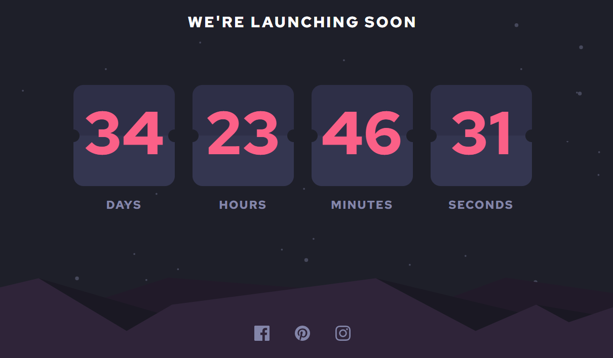

# Frontend Mentor - Launch countdown timer solution

This is a solution to the [Launch countdown timer challenge on Frontend Mentor](https://www.frontendmentor.io/challenges/launch-countdown-timer-N0XkGfyz-). Frontend Mentor challenges help you improve your coding skills by building realistic projects. 

### The challenge

Users should be able to:

- See hover states for all interactive elements on the page
- See a live countdown timer that ticks down every second (Countdown to new year)

### Screenshot

### Links

- Solution URL: [https://www.frontendmentor.io/solutions/launch-countdown-timer-with-react-and-tailwind-css-OvzS_oxCIY]
- Live Site URL: [https://jaacielbriseo.github.io/launch-countdown-timer/]

### Built with

- Semantic HTML5 markup
- Tailwind CSS
- Mobile-first workflow
- [React](https://reactjs.org/) - JS library

## Author

- Frontend Mentor - [@JaacielBriseo](https://www.frontendmentor.io/profile/JaacielBriseo)